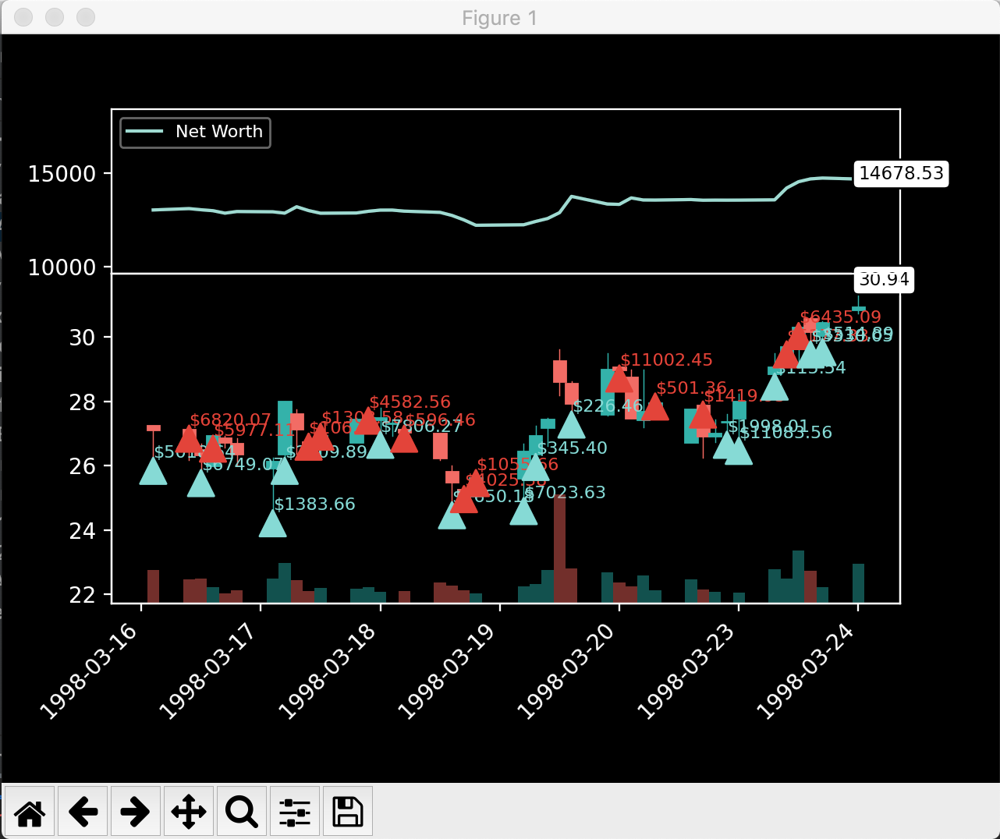
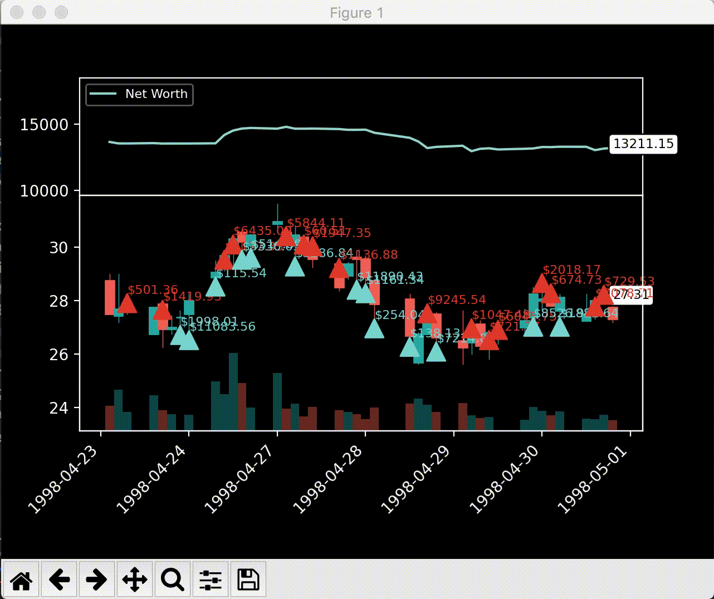

# Gym Env For Stock Trading

A custom OpenAI gym environment for simulating stock trades on historical price data with live rendering.
In this article, we've implemented a simple, yet elegant visualization of the agent's trades using Matplotlib.

Great thanks to:
 - [Creating new Gym Env | by OpenAI](https://github.com/openai/gym/blob/master/docs/creating-environments.md)
 - [Deep Reinforcement Learning Hands On | by Max Lapan](https://github.com/PacktPublishing/Deep-Reinforcement-Learning-Hands-On) (the [book](https://www.amazon.com/Deep-Reinforcement-Learning-Hands-optimization/dp/1838826998/ref=pd_lpo_14_t_0/141-3599991-5740167?_encoding=UTF8&pd_rd_i=1838826998&pd_rd_r=7e13afd8-edda-4ae6-8f59-717cc794a2a4&pd_rd_w=rvOek&pd_rd_wg=OAvkI&pf_rd_p=7b36d496-f366-4631-94d3-61b87b52511b&pf_rd_r=5FSXPNZ8R2M61R45H4EM&psc=1&refRID=5FSXPNZ8R2M61R45H4EM))
 - [Create custom gym environments from scratch — A stock market example | by Adam King](https://towardsdatascience.com/creating-a-custom-openai-gym-environment-for-stock-trading-be532be3910e)
 - [Rendering elegant stock trading agents using Matplotlib and Gym | by Adam King](https://towardsdatascience.com/visualizing-stock-trading-agents-using-matplotlib-and-gym-584c992bc6d4)
 - [Creating Bitcoin trading bots that don’t lose money | by Adam King](https://towardsdatascience.com/creating-bitcoin-trading-bots-that-dont-lose-money-2e7165fb0b29)

## Installation 

In order to run the environment you need to do the following:

1. Copy the repo to your computer.</il>
2. Go to the one directory above of the copied repo on your computer in the Terminal.
3. Click:

`
pip install -e gym-stocktrading
`
> That's it! You've installed the new gym-env on your computer.

## Sanity Check

In another project try to run the environment with this code:

```
import gym

env = gym.make('gym_stocktrading:stocktrading-v0')
ob = env.reset()
done = True

for i in range(100):
    while not done:
        action = env.action_space.sample()
        ob, reward, done, _ = env.step(action)
        env.render()
        if done:
            ob = env.reset()
            done = False

env.close()
```

## Visualization

| Snapshot                     | Gif (in motion) |
| ---------------------------- | ------------- |
|      |   |

---

 ***Enjoy!***
 
 ---
 
 Created by Neural Trading &copy;
